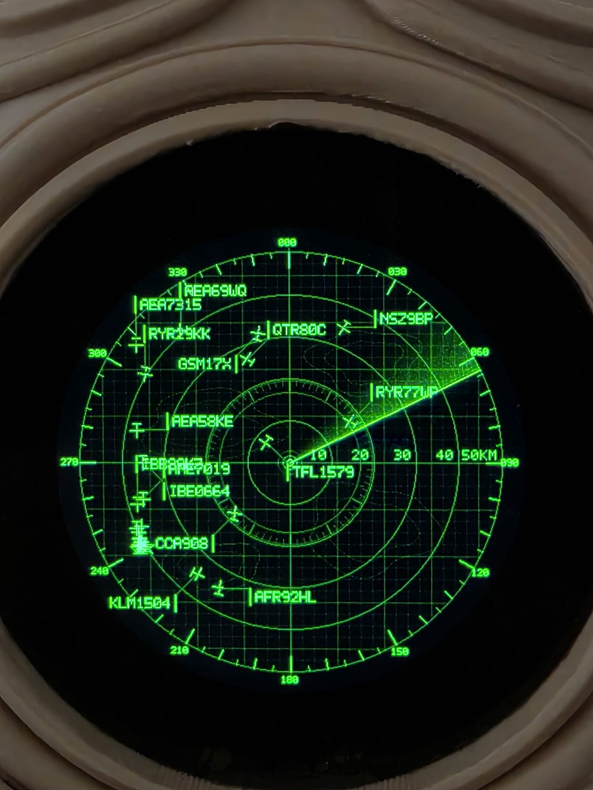
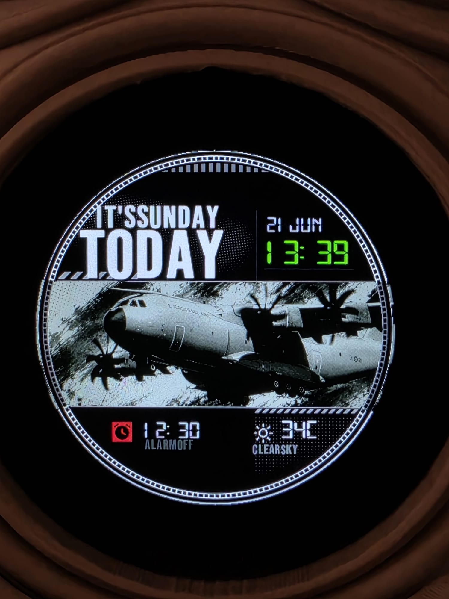
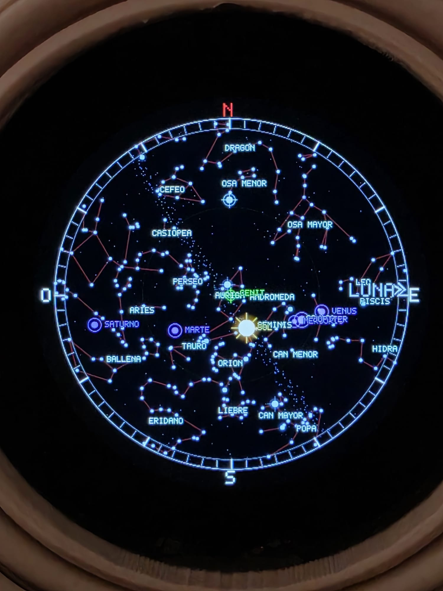
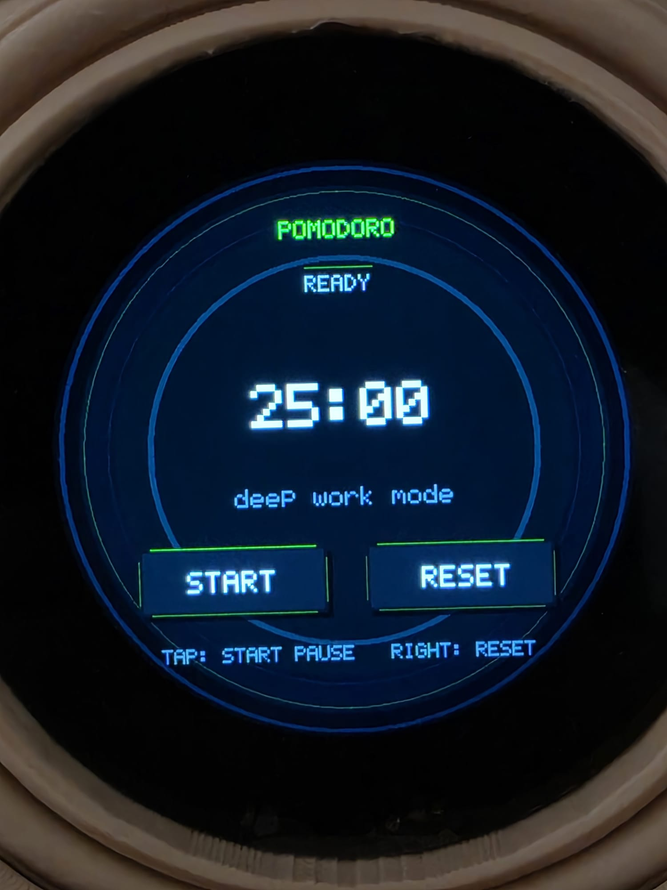
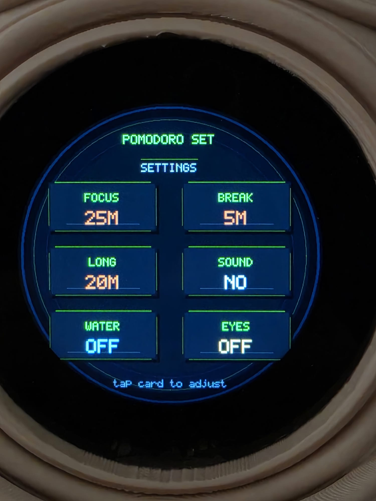
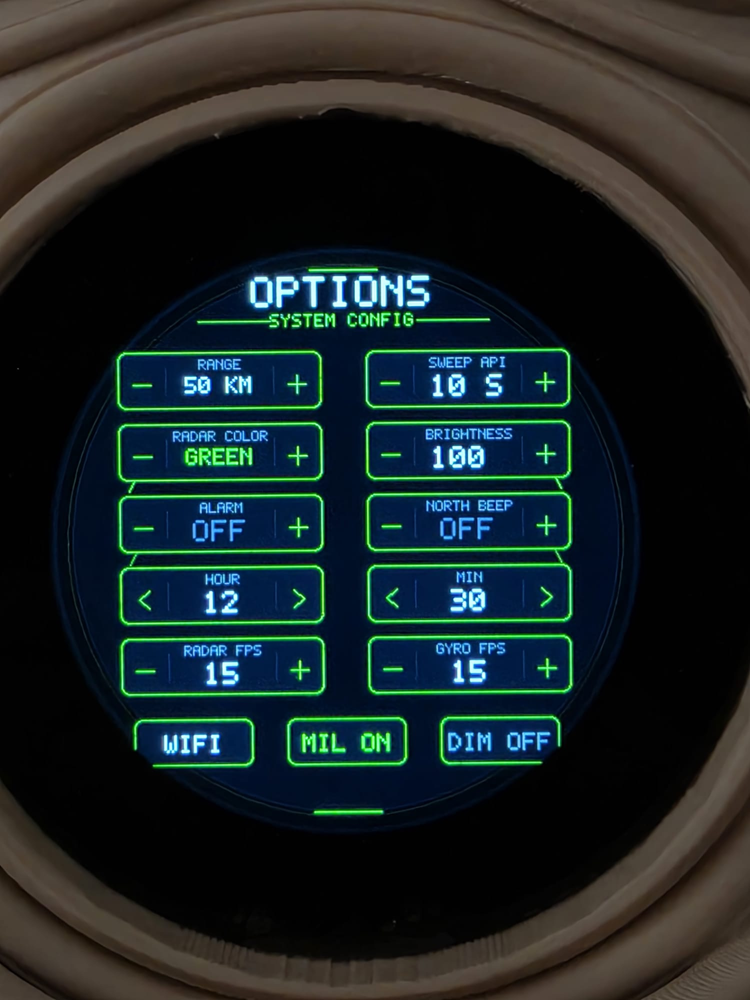
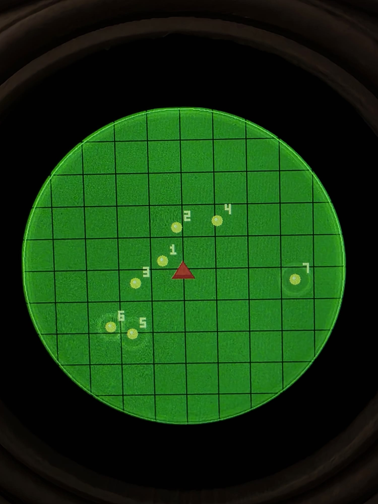

# Radar Caritas ESP32 Workspace

Development workspace for a custom **Waveshare ESP32-S3 Touch LCD 2.1** project that combines:

- a circular radar-style firmware UI
- a local facial animation editor and `.anim` pipeline
- utility scripts for build, flashing, and SD content preparation
- source assets and reusable animation libraries

This project turns the round Waveshare ESP32-S3 display into a multi-mode interactive device with air-traffic radar visuals, sky map views, clock screens, utility tools, and SD-driven animation support.

## Hardware at a glance

- Board: `Waveshare ESP32-S3 Touch LCD 2.1`
- Display: round `480x480` capacitive touch screen
- MCU: `ESP32-S3R8`
- Memory: `16MB` flash + `8MB` PSRAM
- Extras: `QMI8658` IMU, `PCF85063` RTC, buzzer, `TF / microSD`, LiPo support

## Showcase

  
  
  

  
  
  

  

## What the device can do

- Air traffic radar mode with sweep animation, labels, range control, and configurable colors
- Clock and dashboard screens with image-backed layouts
- Sky map / astronomy view
- Pomodoro and utility screens
- Settings UI for brightness, radar refresh, alarms, and behavior
- SD-based facial / image animation workflow prepared from the local editor

## What this repository contains

This repository groups two workflows that are designed to work together.

### 1. Embedded firmware

- PlatformIO / Arduino project for the Waveshare ESP32-S3 Touch LCD 2.1 board
- Circular `480x480` UI with radar screens, clock screens, sky map views, menus, and utility modes
- Wi-Fi setup portal, persistent settings, traffic fetch, weather integration, and SD-based assets

### 2. Animation pipeline

- Local HTML editor to import, crop, sort, classify, and export facial `.anim` files
- Local animation library already converted for SD usage
- Preview and manifest tools to rebuild the final `faces/` output

## Main layout

- `radar2.0/`
  Main firmware project.
- `faces_sd_anim/`
  Animation editor, previews, local manifest, and `.anim` library.
- `exportacion caras  intento 1/`
  Source material and intermediate animation exports kept as creative reference.
- `ABRIR_EDITOR_CARITAS.bat`
  Starts the local animation editor workflow.
- `COMPILAR_Y_SUBIR_RADAR.bat`
  Builds and flashes the firmware.
- `INSTRUCCIONES_CARITAS_ANIM.txt`
  Notes for the facial animation workflow.
- `docs/REPOSITORY_LAYOUT.md`
  Repository structure and versioning notes.

## Quick start

### Animation editor

1. Run `ABRIR_EDITOR_CARITAS.bat`.
2. The script regenerates `faces_sd_anim/local_faces_manifest.json`.
3. It starts a local server at `http://127.0.0.1:8765/editor.html`.
4. From there you can import images, reorder frames, adjust crops, and export the `faces/` library.

### Firmware

1. Open `radar2.0/`.
2. Build with PlatformIO.
3. Use `COMPILAR_Y_SUBIR_RADAR.bat` if you want the automated detect-and-flash flow.

## Requirements

- Windows
- Python available as `py` or `python`
- PlatformIO for firmware builds
- A modern Chromium-based browser for folder access in the animation editor

## Recommended workflow

1. Edit or import animations in `faces_sd_anim/editor.html`.
2. Export the `.anim` library for SD usage.
3. Test the SD output on device.
4. Build and flash the firmware from `radar2.0/`.

## Related documentation

- [Repository layout](./docs/REPOSITORY_LAYOUT.md)
- [Animation workflow notes](./INSTRUCCIONES_CARITAS_ANIM.txt)
- [Firmware README](./radar2.0/README.md)
- [Official Waveshare board documentation](https://docs.waveshare.com/ESP32-S3-Touch-LCD-2.1)
